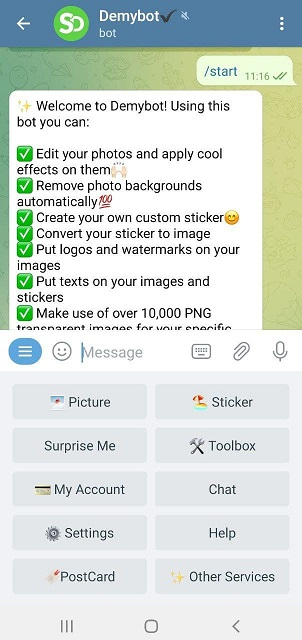

#   Demybot

Demybot is a [Telegram][Telegram] chatbot that provides photo utilities such as editing, creating stickers, apply effects and many more. Demybot was first launched in 2015 and has been on a constant improvement ever since. Total of 2 million users have used Demybot so far. Its monthly active users aka MAU has reached up to 50k. There are more than 20 features built in this chatbot. 

You can start working with [Demybot][Demybot] if you have a [Telegram][Telegram] account. The English version of the bot is not 100% complete and needs more translations and modifications. 

### Bot Preview

## About the **Project**

[Demybot]: https://t.me/demybot?lan_en
[Telegram]: https://telegram.org